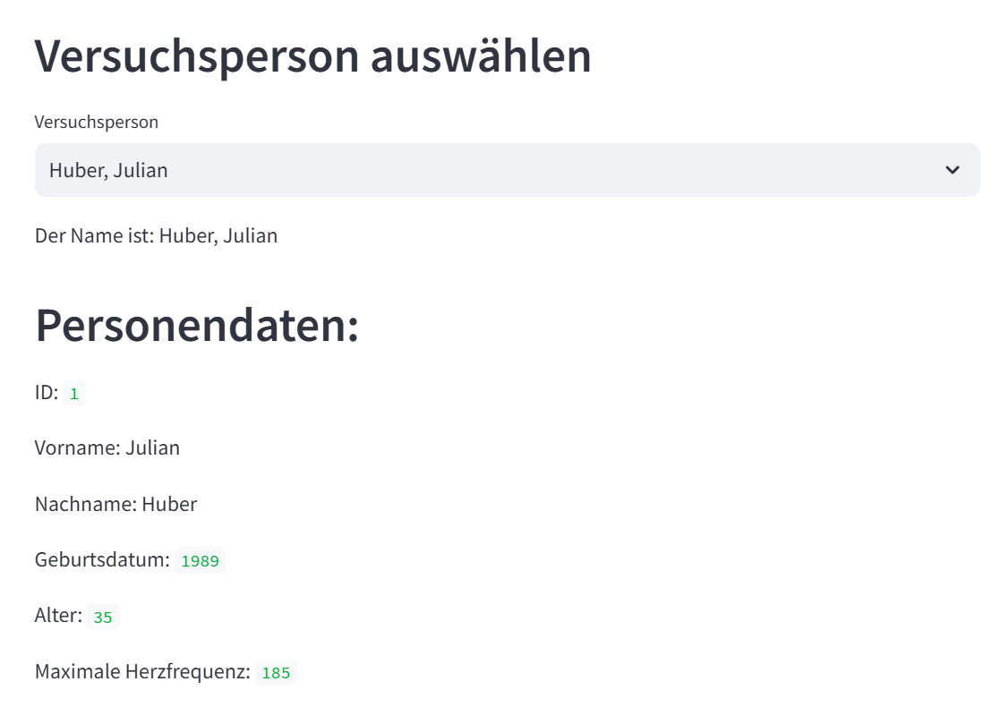
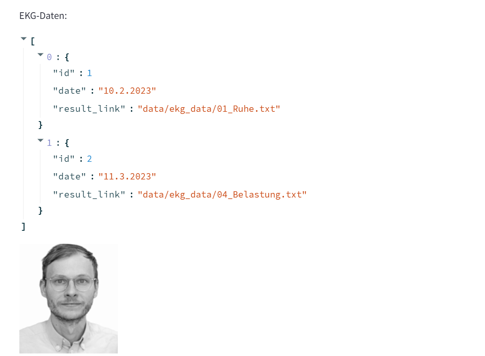
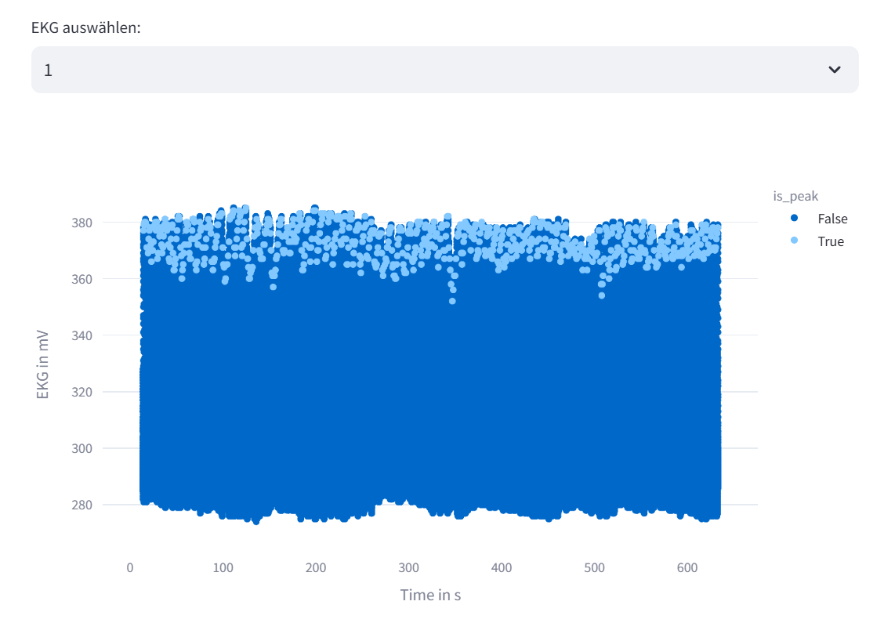
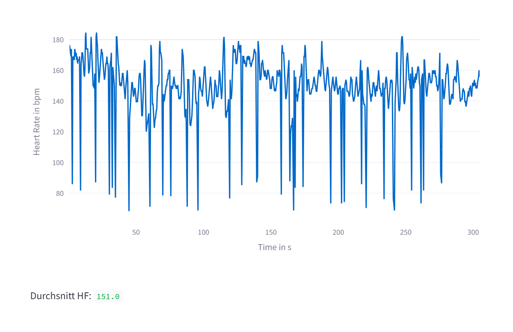

## Beschreibung der App
Die App dient dazu Patienten aufzurufen und verschiedene hinterlegte Daten zu öffnen. Zum Einen zeigt die App den Namen des Patienten, sein Foto, Geburtsdatum, Alter, maximale Herzfrequenz und seine ID in der Datenbank an. Außerdem gibt die App, falls vorhanden, die hinter dem Patienten gespeicherte EKG-Daten (inkl. EKG-Id, Datum und result link) aus. Je nach dem wie viele EKGs vorhanden sind, kann man über die EKG-Id einen Datensatz auswählen und die EKG-Daten werden in mV pro Sekunde als Plot anzeigt. Falls nur ein Datensatz vorhanden ist, wird automatisch nur dieser als Plot angezeigt. Neben dem EKG-Plot zeigt die App auch einen Plot der Herzfrequenz in bpm pro Sekunde, die während des EKGs gemessen wurde, an. Passend dazu gibt die App außerdem die durchschnittliche Herzfrequenz während der Messung aus. 

## Starten der App
Um die App starten zu können müssen zuerst die benötigten Bibliotheken aus der requirements.txt Datei installiert werden. Anschließend wird mit dem Befehl "streamlit run main.py" die main.py ausgeführt. Um das tun zu können, muss man sich in dem Ordner befinden, in dem die main.py liegt. Das geht mit dem Befehl "cd" und dem entsprechenden Pfad in den Ordner dahinter. Nachdem die main.py ausgeführt wurde, öffnet sich automatisch "streamlit" mit der App in einem Browser-Fenster. Hier können nur über eine Selectbox die einzelnen Patienten ausgewählt werden und die Daten werden angezeigt. Falls mehrere EKG-Datensätze vorhanden sind, können die EKG-Ids auch über eine Selectbox ausgewählt werden.