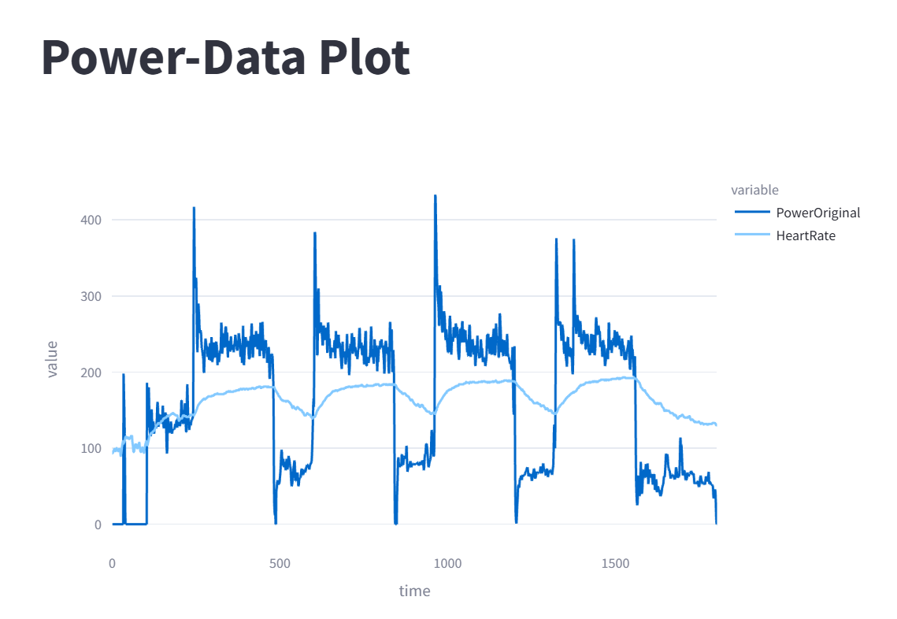
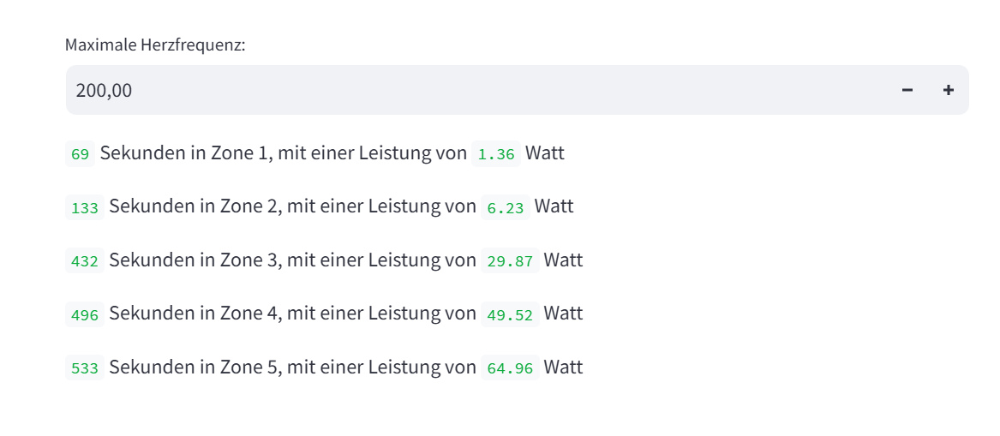

# Aufgabe_3-5
## Aufgabe 3

### Beschreibung der App
Die App verarbeitet die bei einer Aktivität erbrachte Leistung und die dabei aufgezeichnete Herzfrequenz. Der Nutzer kann seine maximale Herzfrequenz in die App eingeben und diese gibt aus, wie lange (in Sekunden) der Nutzer während der Aktivität in den einzelnen Herzfrequenzzonen trainiert hat. Außerdem zeigt die App an welche durchschnittliche Leistung (in Watt) in den einzelnen Zonen erbracht wurde. 

### Starten der App
Um die App starten zu können müssen zuerst die benötigten Bibliotheken aus der requirements.txt Datei installiert werden. Anschließend wird mit dem Befehl "streamlit run main.py" die main.py ausgeführt. Um das tun zu können, muss man sich in dem Ordner befinden, in dem die main.py liegt. Das geht mit dem Befehl "cd" und dem entsprechenden Pfad in den Ordner dahinter. Nachdem die main.py ausgeführt wurde, öffnet sich automatisch "streamlit" mit der App in einem Browser-Fenster. Hier kann dann die maximale Herzfrequenz eingegeben werden und die App gibt die Werte aus.

## Aufgabe 4

### Beschreibung der App
Um mit der App eine Leistungskurve erstellen zu können, muss eine Liste ("Intervall_list") übergeben werden, die alle Zeitintervalle (in Sekunden) beinhaltet, von denen die maximale Leistung, die erbracht werden kann, ausgegeben werden soll. Die Zeitinervalle beginnen immer bei 0 Sekunden, das heißt in der Liste stehen nur noch die Endwerte der Intervalle.
Außerdem muss der App bei der Variable "fs" übergeben werden, wie viele Werte pro Sekunde der Datensatz enthält. 
Die Zeitintervalle werden für die Anzeige des Plots von der App in Minuten umgewandelt und die Power Curve wird ausgegeben.  
